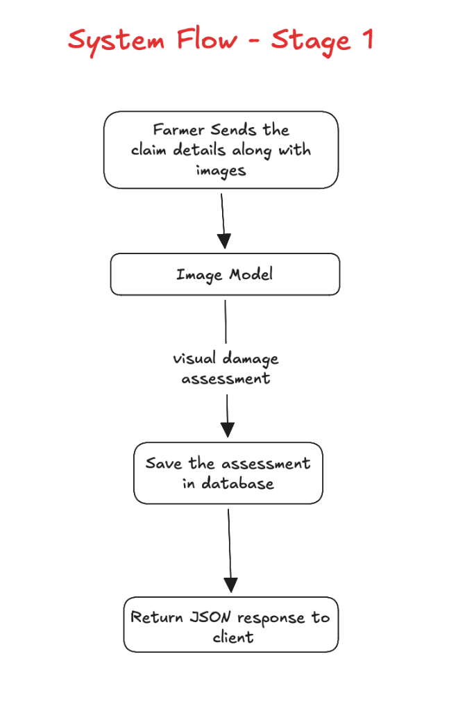

# Stage 1: Crop Photo Damage Assessment API

## Goal of Stage 1
Build a simple FastAPI server that takes a crop photo, runs our trained AI model, checks if the crop is healthy or damaged, calculates the damage percentage (0% to 100%), and saves the result in a SQLite database.

---

## 5-Stage Overview
- **Stage 1 (Now):** AI checks the crop photo (Healthy vs. Damaged + Damage %).
- **Stage 2:** Add Weather data (check if rainfall and temperature match the claim).
- **Stage 3:** Add Fraud detection (XGBoost catches fake or exaggerated claims).
- **Stage 4:** Add Explainable AI (SHAP explains why) and a simple web screen.
- **Stage 5:** Generate research paper tables and add Blockchain.

---

## What Happens in Stage 1



```text
Farmer sends Photo + Claim Details
               │
               ▼
        FastAPI Route (POST /api/claims)
               │
               ▼
         Claim Service
               │
        ┌──────┴──────────────────────┐
        ▼                             ▼
  Vision Model                   SQLite Database
(Healthy vs Damaged)           (Saves claim & result)
(Calculates Damage %)
        │                             │
        └──────┬──────────────────────┘
               ▼
      Return JSON Response
```

---

## Step-by-Step Tasks for Stage 1

### Step 1: Config & Errors
- `app/configs/settings.py`: Sets server port (8000), database path, and model file path.
- `app/errors/app_error.py`: Handles errors simply and returns clear error messages.

### Step 2: Database (`app/db/`)
- `session.py`: Connects to local `data/crop_insurance.db`.
- `models.py`: Creates 3 simple tables:
  1. `claims` (farmer ID, crop type, claimed damage, photo path)
  2. `claim_assessments` (AI damage %, visual class, confidence)
  3. `audit_logs` (record of when claim was submitted and assessed)

### Step 3: AI Vision Engine (`app/core/vision_engine.py`)
- Loads our trained model: `models_saved/vision_model_initial.h5`.
- Resizes photo to 224x224.
- Predicts:
  - Is it **HEALTHY** or **DAMAGED**?
  - What is the **Damage %** (0% to 100%)?
  - What is the **Confidence** (e.g. 92%)?

### Step 4: Claim Service & API Route (`app/modules/claims/`)
- `claim_schema.py`: Checks input data (farmerId, cropType, claimedDamage, image).
- `claim_repository.py`: Saves data into SQLite.
- `claim_service.py`: Connects everything (saves photo, calls AI, saves to DB).
- `claim_routes.py`: Creates `POST /api/claims` and `GET /api/claims/{claim_id}`.

### Step 5: Server Entry (`main.py` & `run.py`)
- Connects the routes and starts FastAPI on port 8000.
- Enables the `/docs` test page in browser.

---

## How We Will Test Stage 1
Open `http://localhost:8000/docs`, send a test photo, and verify the response:

```json
{
  "success": true,
  "message": "Claim visual assessment completed",
  "data": {
    "claimId": "CR1001",
    "cropType": "rice",
    "claimedDamage": 70,
    "visualClass": "DAMAGED",
    "damageSeverity": 68,
    "confidence": 0.92
  }
}
```
