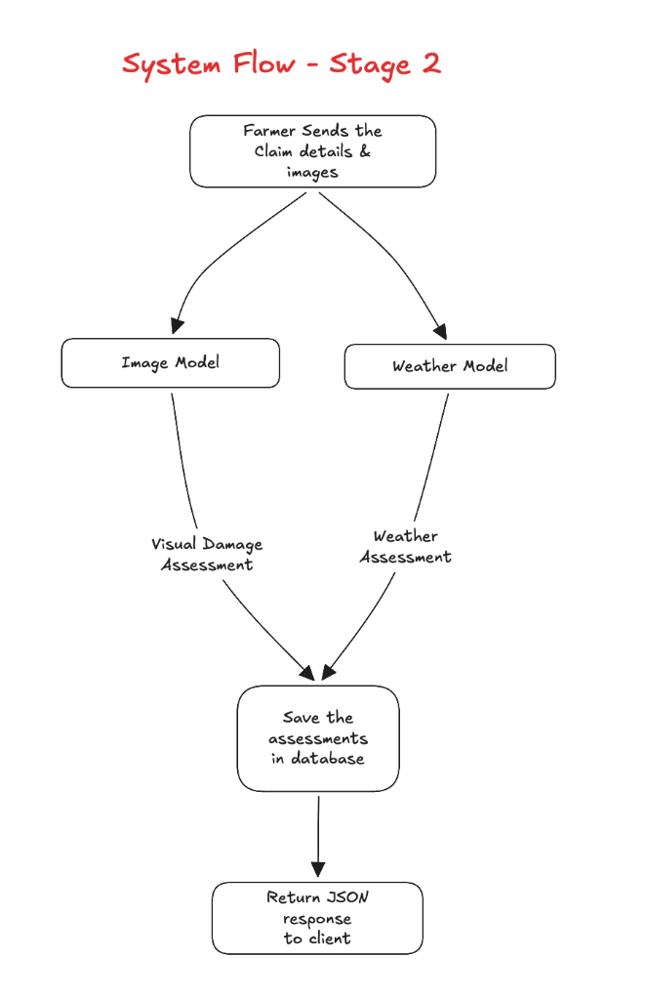

# Stage 2: Historical Weather Verification & Damage Classification

## Goal of Stage 2

In crop insurance, a crop photograph alone is not enough to prove what caused the damage. A farmer might submit a photo of dry grass from years ago, an unrelated field, or claim a flood when no rain occurred.

Stage 2 adds **ground-truth weather verification**:
Given the farm's GPS coordinates (`latitude`, `longitude`) and the `incidentDate`, our system checks public meteorological records, calculates a continuous **Weather Impact Score** (0% to 100%), and classifies the exact cause of damage:

- **FLOOD / WATERLOGGING**
- **DROUGHT / HEAT STRESS**
- **STORM / WIND LODGING**
- **PLANT DISEASE / PEST**
- **NORMAL (NO DAMAGE)**

---

## 1. Which Weather Fields We Need & Why

We only need **4 core numbers** for the 7-day window surrounding the claimed disaster date:

| Field Name        | Unit             | Why It Matters to Crops                                                                                                          |
| :---------------- | :--------------- | :------------------------------------------------------------------------------------------------------------------------------- |
| **`rainfall_mm`** | Millimeters (mm) | **Floods & Droughts**: Heavy rain (> 75–100 mm in 48h) causes flooding and waterlogging. Zero rain over 14+ days causes drought. |
| **`temp_max`**    | Celsius (°C)     | **Heatwaves**: Temperatures above 38°C–40°C cause extreme heat stress and burn crops.                                            |
| **`temp_min`**    | Celsius (°C)     | **Frost / Cold Waves**: Temperatures below 4°C freeze and destroy crop plant cells.                                              |
| **`wind_speed`**  | km/h             | **Storm Damage (Lodging)**: Peak wind gusts above 60 km/h flatten standing rice, wheat, and corn crops.                          |

---

## 2. Where the Weather Data Comes From

In the mentor's research requirements (Section 12: Dataset Strategy):

> `| Weather | Historical rainfall, temperature, and extreme-weather datasets |`

We access two of the world's most prestigious open public datasets:

1. **ERA5 Reanalysis Dataset** (ECMWF — the gold standard public climate dataset used in agricultural research papers).
2. **NOAA Global Historical Climatology Network** (US National Oceanic and Atmospheric Administration).

We query these public datasets directly using the free **Open-Meteo Historical Archive API** (requires zero API keys, supports all GPS coordinates in India and worldwide) and store a local copy in `server/data/` for offline research benchmarks.

---

## 3. How We Classify the Cause of Damage (Photo + Weather)

Neither the photograph alone nor the weather data alone can tell the full story. But when we look at **both together**, classifying the exact cause of crop damage becomes simple and logical:

### The Decision Matrix:

| Visual AI (Photo) | Weather Data (Public Dataset)                  | Classified Cause of Damage | Why It Works                                                                                                                                                          |
| :---------------- | :--------------------------------------------- | :------------------------- | :-------------------------------------------------------------------------------------------------------------------------------------------------------------------- |
| **Damaged**       | **Rainfall > 75–100 mm** in 48 hrs             | **FLOOD / WATERLOGGING**   | Torrential rainfall and flood conditions confirm waterlogging.                                                                                                        |
| **Damaged**       | **0 mm Rain for 14+ days** AND **Temp > 38°C** | **DROUGHT / HEAT STRESS**  | High heat and severe rainfall deficit confirm drought conditions.                                                                                                     |
| **Damaged**       | **Wind Gusts > 60 km/h**                       | **STORM / WIND LODGING**   | Severe wind gusts flattened the standing crop.                                                                                                                        |
| **Damaged**       | **Normal Weather** (Mild rain, 25°C–32°C)      | **PLANT DISEASE / PEST**   | The crop is damaged, but the weather was completely calm and safe. Therefore, the destruction is **biological** (fungal infection, bacterial blight, or pest attack). |
| **Healthy**       | **Normal Weather**                             | **NORMAL (NO DAMAGE)**     | The crop is green and healthy, and the climate is safe.                                                                                                               |

### Classification Logic in Code:

```python
if visual_damage < 25.0:
    damage_type = "NORMAL"

elif weather.rainfall_mm > 75.0:
    damage_type = "FLOOD"

elif weather.consecutive_dry_days >= 14 and weather.temp_max > 38.0:
    damage_type = "DROUGHT"

elif weather.wind_speed > 60.0:
    damage_type = "STORM_LODGING"

else:
    # Crop is damaged, but weather was normal -> must be biological disease
    damage_type = "PLANT_DISEASE"
```

---

## 4. How This Catches Fraud (Stage 4 Connection)

This directly enables the mentor's fraud detection requirement (Section 5):

```text
Case 1: Genuine Claim
- Farmer claims: "75% Flood Damage"
- Visual AI: 76.6% Damage
- Public Weather Dataset: 110 mm Rainfall (Flood confirmed)
- Result: Evidence matches. Genuine claim approved.

Case 2: Fraudulent / Mismatched Claim
- Farmer claims: "90% Flood Disaster"
- Visual AI: 80% Damage
- Public Weather Dataset: 0 mm Rain, 30°C Sunny week
- Result: Weather proves NO flood occurred. The field suffered from plant disease or the farmer used an old photo.
- Action: Claim is flagged for FRAUD RISK (Cause Mismatch).
```

---

## 5. System Flow in Stage 2



```text
Farmer sends Claim (GPS Coordinates + Incident Date + Photos)
                           │
                           ▼
                 FastAPI Claim Route
                           │
                           ▼
                     Claim Service
                           │
               ┌───────────┴───────────┐
               ▼                       ▼
         Vision Engine          Weather Provider
        (MobileNetV2)       (Public Weather Archive)
        - Healthy/Damaged   - Rainfall (mm)
        - Visual Damage %   - Max/Min Temp (°C)
               │            - Wind Gusts (km/h)
               │                       │
               │                       ▼
               │                 Weather Engine
               │             - Weather Damage Score (0-100%)
               │             - Damage Cause (Flood, Drought, Disease)
               │                       │
               └───────────┬───────────┘
                           ▼
                    SQLite Database
             (Saves claim, photos, visual metrics,
              weather score, and classified damage cause)
                           │
                           ▼
                  Return JSON Response
```

---

## 6. Step-by-Step Implementation Tasks

### Task 2.1: Weather Provider (`server/app/providers/weather_provider.py`)

- Connects to the free Open-Meteo Historical Weather Archive API.
- Accepts `latitude: float`, `longitude: float`, `incident_date: str`.
- Pulls daily rainfall, max/min temperatures, and wind gusts for the 7-day window.
- Includes local cached fallback for reliable offline testing.

### Task 2.2: Weather Engine (`server/app/core/weather_engine.py`)

- Computes continuous `weather_score` (0% to 100%).
- Determines the meteorological hazard (`FLOOD`, `DROUGHT`, `STORM_LODGING`, or `NORMAL`).
- Returns structured weather summary metrics.

### Task 2.3: Multimodal Engine (`server/app/core/multimodal_engine.py`)

- Implements the Multimodal Decision Matrix.
- Fuses visual assessment from MobileNetV2 with meteorological hazard evidence from ERA5/NOAA.
- Classifies the true damage cause (`FLOOD`, `DROUGHT`, `STORM_LODGING`, `PLANT_DISEASE`, or `NORMAL`).

### Task 2.4: Database Updates (`server/app/db/models.py`)

- Update `claims` table: add `latitude`, `longitude`, `incident_date`.
- Update `claim_assessments` table: add `weather_score`, `damage_cause`, `weather_details`.

### Task 2.5: Claims Module Integration (`server/app/modules/claims/`)

- Update `SubmitClaimRequest` schema to accept optional `latitude`, `longitude`, `incidentDate`.
- Update `ClaimService` to orchestrate vision, weather, and multimodal fusion.
- Add standalone test endpoint `POST /api/weather/verify` to test weather verification independently in Postman.

---

## 7. Verification Plan

1. **Flood Scenario Test**:
   - Location: `16.5, 80.6` (Vijayawada), Date: `2024-09-02` (known heavy flood/cyclone).
   - Expected: `rainfall > 80 mm`, `damage_cause: "FLOOD"`, `weatherScore > 75%`.
2. **Normal / Plant Disease Scenario Test**:
   - Location: `16.5, 80.6`, Date: `2024-11-15` (sunny, mild weather).
   - Expected: `damage_cause: "PLANT_DISEASE"` (if damaged photo is uploaded), `weatherScore < 15%`.
3. **End-to-End Postman Claim Test**:
   - Submit claim with photo + GPS coordinates + incident date.
   - Verify that response contains visual damage %, weather score %, and classified damage cause.
