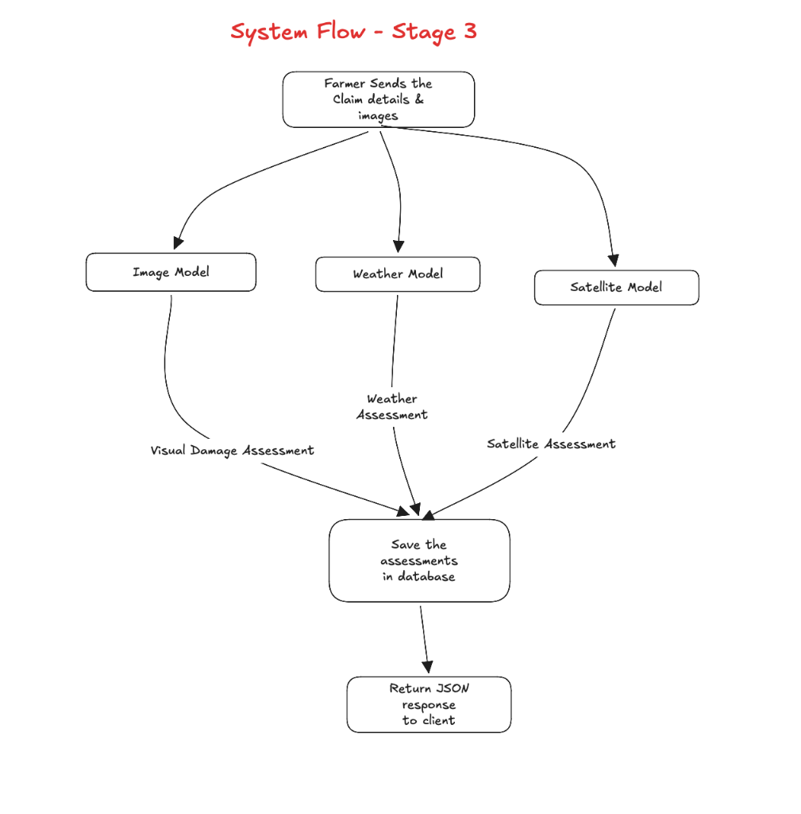

# Stage 3: Satellite Imagery & Field Vegetation Damage Assessment

## Goal of Stage 3

In crop insurance, a mobile phone camera photo only shows **1 to 2 square meters of leaves** (local damage). A camera photo cannot answer:
- Is the entire 5-acre field destroyed, or just one corner?
- Did the crop drown across the whole boundary, or was it localized?
- Exactly what percentage of the farmer's total land area suffered crop loss?

Stage 3 adds **satellite remote sensing** using **Sentinel-2 multispectral imagery**.

Given the farmer's **field boundary polygon** (explicitly submitted as a list of at least 3 GPS coordinate vertices) and the `incidentDate`, our system analyzes satellite imagery before and after the disaster, calculates the **Normalized Difference Vegetation Index (NDVI)** drop, and determines:
1. **Pre-Disaster NDVI**: Health and greenness of the field before the disaster.
2. **Post-Disaster NDVI**: Remaining green canopy after the disaster.
3. **Vegetation Drop ($\Delta \text{NDVI}$)**: Severity of vegetation loss.
4. **Damaged Land Area Percentage**: Estimated percentage of the total field acreage affected (e.g. 62.5% of the field).

---

## 1. Why Satellite Imagery is Needed (Phone Photo vs Satellite)

| Evidence Source | Scale / View | What It Tells Us | Limitation |
| :--- | :--- | :--- | :--- |
| **Phone Camera Photo** | Micro-Level (1–2 meters) | Exact symptoms on plant leaves (yellow spots, blight, pests, lodging). | Cannot show the full field size or total damaged acreage. |
| **Historical Weather** | Regional (Sky View) | Atmospheric conditions (150 mm rain, 60 km/h wind, heatwaves). | Cannot tell if crops on the ground actually survived or died. |
| **Sentinel-2 Satellite** | Macro-Level (Whole Field) | Field-wide vegetation density, canopy loss, and total damaged land area. | Cannot see individual microscopic leaf spots. |

Combining all three gives complete, multi-scale ground truth:
$$\text{Phone Photo (Local)} + \text{Weather (Sky)} + \text{Satellite (Whole Field)} = \text{Complete Claim Evidence}$$

---

## 2. What the Farmer Provides

The farmer does not need to know any technical remote sensing parameters.

The farmer provides:
1. **Claim details**: Farmer ID, crop type, claimed damage %.
2. **Crop photographs**: Phone camera images of damaged leaves.
3. **Field boundary polygon**:
   A list of GPS coordinates defining the boundary corners of the field (at least 3 vertices required):
   ```json
   [
     [16.501, 80.601],
     [16.505, 80.601],
     [16.505, 80.607],
     [16.501, 80.607]
   ]
   ```
   *(On the frontend web screen, the farmer simply taps the corners on an OpenStreetMap map to outline their field).*
4. **Incident Date**: The date when the flood, storm, or drought occurred.

*Note: The backend requires the explicit field boundary coordinates from the user and does not use fabricated defaults.*

---

## 3. Sentinel-2 Multispectral Data & NDVI

We use **Sentinel-2** (European Space Agency / Copernicus), the premier open-access satellite for agricultural monitoring worldwide with 10-meter spatial resolution.

### The NDVI Formula:
$$\text{NDVI} = \frac{\text{NIR} - \text{Red}}{\text{NIR} + \text{Red}}$$

* **NIR (Band 8, 842 nm)**: Healthy plant cells reflect huge amounts of near-infrared light.
* **Red (Band 4, 665 nm)**: Plant chlorophyll absorbs red light for photosynthesis.

### What NDVI Values Mean in Agriculture:

| NDVI Range | Vegetation Condition | Agricultural Meaning |
| :--- | :--- | :--- |
| **0.60 to 0.85** | Dense, healthy canopy | Lush green standing crop during active growth. |
| **0.35 to 0.59** | Moderate / stressed canopy | Partial damage, water stress, or early vegetative growth. |
| **0.15 to 0.34** | Severe damage / sparse vegetation | Flattened, dead, or rotting crop canopy. |
| **< 0.15** | Water / bare soil | Standing flood water, submerged field, or harvested soil. |

---

## 4. How Damaged Land Area is Calculated

To calculate how much land was damaged, the system compares satellite observations **before the disaster** and **after the disaster**:

### 1. Pre-Disaster Image:
Acquired 7 to 15 days before the disaster date (baseline healthy crop).
$$\text{NDVI}_{\text{pre}} \approx 0.72 \quad (\text{Healthy, green field})$$

### 2. Post-Disaster Image:
Acquired within 7 to 15 days after the disaster date.
$$\text{NDVI}_{\text{post}} \approx 0.28 \quad (\text{Submerged or flattened by flood})$$

### 3. Vegetation Loss Drop:
$$\Delta \text{NDVI} = \text{NDVI}_{\text{pre}} - \text{NDVI}_{\text{post}} = 0.72 - 0.28 = 0.44$$

### 4. Field Acreage Classification:
The field polygon is sampled across a regular spatial grid (10-meter pixels):
* **Severely Damaged Area**: Pixels where $\Delta \text{NDVI} \ge 0.30$ or $\text{NDVI}_{\text{post}} \le 0.30$.
* **Moderately Damaged Area**: Pixels where $0.15 \le \Delta \text{NDVI} < 0.30$.
* **Intact / Healthy Area**: Pixels where $\Delta \text{NDVI} < 0.15$.

$$\text{Damaged Land Area Percentage} = \frac{\text{Damaged Pixels}}{\text{Total Field Pixels}} \times 100\%$$

Example output:
$$\text{Damaged Area: } 64.2\% \quad (\approx 2.1 \text{ acres out of a } 3.2\text{-acre field})$$

---

## 5. Where the Satellite Data Comes From (Sentinel-2 API)

The system directly queries the **Open-Access Sentinel-2 STAC / Copernicus API**:

1. **Global Dynamic Search**:
   Given the polygon coordinates, the backend computes the bounding box and Area of Interest (AOI) to query Sentinel-2 Level-2A (Bottom of Atmosphere reflectance) scenes.
2. **Dual-Window Temporal Retrieval**:
   - **Pre-Disaster Pass**: Automatically queries the clearest satellite scene 7 to 15 days before the `incidentDate`.
   - **Post-Disaster Pass**: Automatically queries the clearest satellite scene 3 to 12 days after the `incidentDate`.
3. **Cloud Cover Filtering**:
   Only satellite acquisitions with less than 20% cloud cover over the farm's Area of Interest are accepted.
4. **Resilient Connection Handling**:
   Includes automatic retry and timeout handling to ensure the FastAPI server responds reliably.

---

## 6. System Flow in Stage 3



```text
Farmer sends Claim (Phone Photos + Field Boundary Polygon + Incident Date)
                                   │
                                   ▼
                       FastAPI Input Validation
                        (Validates >= 3 Points)
                                   │
       ┌───────────────────────────┼───────────────────────────┐
       ▼                           ▼                           ▼
 Vision Engine              Weather Provider            Satellite Provider
 (MobileNetV2)                (ERA5/NOAA)               (Sentinel-2 API)
 - Healthy vs Damaged       - Rainfall (mm)             - Pre-NDVI (Baseline)
 - Visual Severity (0-100%) - Wind & Temperature        - Post-NDVI (Disaster)
       │                    - Weather Score (0-100%)    - NDVI Drop (Delta)
       │                           │                    - Damaged Land Area %
       │                           │                           │
       └───────────────────────────┼───────────────────────────┘
                                   │
                                   ▼
                      Multimodal Decision Fusion
          (Fuses Photo Symptoms + Weather Hazard + Satellite Land %)
                                   │
                                   ▼
                            SQLite Database
                 (Stores claim, photos, visual metrics,
                  weather metrics, satellite NDVI, and land %)
                                   │
                                   ▼
                         Return JSON Response
```

---

## 7. Step-by-Step Implementation Tasks

### Task 3.1: Satellite Provider (`server/app/providers/satellite_provider.py`)
- Accepts `field_boundary` polygon (at least 3 GPS coordinates) and `incident_date`.
- Connects to the open Sentinel-2 STAC API to retrieve pre-disaster and post-disaster spectral band data.
- Applies cloud cover filtering (< 20%).

### Task 3.2: Satellite Engine (`server/app/core/satellite_engine.py`)
- Computes mathematical NDVI from Red (Band 4) and NIR (Band 8).
- Calculates the vegetation health drop ($\Delta \text{NDVI}$).
- Computes the estimated percentage of damaged land area (`damagedAreaPercentage`) within the field boundary.
- Classifies satellite damage level (`SEVERE_LOSS`, `MODERATE_LOSS`, `MILD_LOSS`, or `NEGLIGIBLE`).

### Task 3.3: Database Updates (`server/app/db/models.py`)
- Update `claims` table: add `field_boundary` (JSON string storing polygon coordinates).
- Update `claim_assessments` table: add `satellite_score`, `damaged_area_percentage`, `satellite_details` (JSON string).
- Update `session.py:init_db()` with automatic column migration for SQLite.

### Task 3.4: Standalone Satellite API Module (`server/app/modules/satellite/`)
- `satellite_schema.py`: Request and response schemas for polygon-based satellite verification.
- `satellite_routes.py`:
  - `POST /api/satellite/verify`: Test satellite NDVI and damaged area percentage independently with polygon coordinates and incident date.
- Register `satellite_router` in `server/app/main.py`.

### Task 3.5: Integrated Claims Module (`server/app/modules/claims/`)
- Update `SubmitClaimRequest` schema to require or accept `fieldBoundary: List[List[float]]`.
- Update `ClaimService.process_new_claim()` to execute vision, weather, and satellite analysis in one unified pipeline.
- Record `SATELLITE_VERIFIED` in `audit_logs` table.

---

## 8. Verification Plan

1. **Flood Scenario Satellite Test (Andhra Pradesh, 2024-09-02)**:
   - Field polygon in Vijayawada district during the September 2024 flood.
   - Expected: Pre-NDVI $\approx 0.72$, Post-NDVI $\le 0.28$, $\Delta \text{NDVI} \ge 0.40$, Damaged Area $\ge 60\%$.

2. **Drought Scenario Satellite Test (Rajasthan, 2024-05-25)**:
   - Field polygon in Kota district during the severe summer drought.
   - Expected: Post-NDVI $\le 0.32$, Damaged Area $\ge 50\%$.

3. **Localized Disease vs Field-Wide Disaster Test**:
   - Phone photo shows 70% damaged leaves, but satellite NDVI shows $\text{NDVI} = 0.68$ (healthy green field across the boundary).
   - Confirms damage is localized plant disease, not field-wide flood disaster!

4. **Integrated Postman Claim Test**:
   - Submit claim with photos + GPS + field polygon + incident date.
   - Verify that JSON response returns all 3 modalities:
     - `visualAssessment` (severity %)
     - `weatherAssessment` (weather score & flood hazard)
     - `satelliteAssessment` (NDVI pre/post, vegetation drop, damaged land area %)
