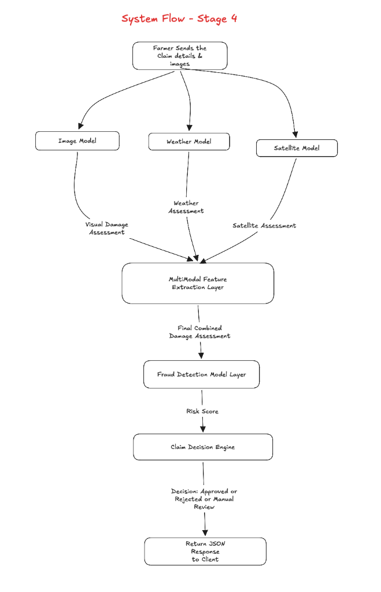

# Stage 4: Multimodal AI Fusion & Fraud Detection Engine (XGBoost)

## Goal of Stage 4

In crop insurance, insurance companies lose huge amounts of money each year to **fraudulent, fabricated, or exaggerated claims**.

A single source of data cannot catch a lie:
* A farmer can download a photo of damaged leaves from the internet.
* A farmer can photograph one broken plant, claiming all 10 acres of their land died.
* A farmer can claim massive flood damage during a completely dry week.

Stage 4 builds the **Multimodal Fraud Detection Engine** using **XGBoost (Extreme Gradient Boosting)**.

It takes the evidence extracted from all previous stages:
1. **Photo Leaf Damage Severity** (Stage 1: MobileNetV2)
2. **Recorded Weather Conditions & Hazard** (Stage 2: ERA5 Historical Climate Data)
3. **Whole-Field Satellite Vegetation Drop & Damaged Land Area** (Stage 3: Sentinel-2 Multispectral NDVI)
4. **Farmer Claim Information & Duplicate Photo Hashing** (Claim details & past submissions)

The XGBoost model cross-references these evidence streams, detects contradictions, calculates a mathematical **Fraud Risk Score (0.00 to 1.00)**, issues an automated decision (**APPROVED**, **MANUAL_REVIEW**, or **REJECTED**), and calculates the **fair recommended payout**.

---

## 1. Understanding the Terms: Multimodal AI vs. XGBoost vs. Fraud Detection

These three terms often cause confusion, but their relationship is simple:

| Term | What It Represents | Role in Our System |
| :--- | :--- | :--- |
| **Multimodal AI** | **The Input Architecture** | Combining multiple different data types (photos + weather numbers + satellite NDVI). |
| **XGBoost** | **The Machine Learning Algorithm** | The trained gradient-boosted decision tree algorithm that processes the combined features. |
| **Fraud Detection** | **The Output Task** | The business problem being solved: predicting whether the claim is genuine or fraudulent. |

```text
  INPUTS (Multiple Modalities)                ALGORITHM                 OUTPUT (The Task)
  
  [Modality 1: Photo Damage %]   ──┐
                                   │
  [Modality 2: Weather Rainfall] ──┼───>  [ XGBoost Model ]  ───>  FRAUD DETECTION:
                                   │                              - Risk Score: 0.85
  [Modality 3: Satellite Land %] ──┤                              - Decision: REJECT
                                   │                              - Payout: $0
  [Modality 4: Farmer Claim %]   ──┘
```

**XGBoost is the Multimodal Machine Learning algorithm whose job is Fraud Detection.**

---

## 2. The 4 Types of Fraud This Engine Catches

### 1. Damage Exaggeration Fraud
* **Scenario**: A brief, light hailstorm tears a few scattered leaf tips (20% visual loss, 15% satellite land drop), but the farmer self-reports **90% total loss** on the insurance portal to claim maximum financial payout.
* **How It Is Caught**: The model calculates the gap between self-reported loss and verified satellite/photo damage. When `claimed_damage - satellite_damaged_area > 40%`, the fraud risk score increases sharply.

### 2. Weather Contradiction Fraud
* **Scenario**: A farmer claims complete crop loss due to a catastrophic flood, but historical ERA5 weather records confirm zero rainfall (0.0 mm) and clear sunny skies on that date.
* **How It Is Caught**: Cross-referencing claimed disaster type against meteorological hazard indicators.

### 3. Whole-Field vs Local Patch Fraud
* **Scenario**: A farmer takes close-up camera photos of one damaged corner of their field, claiming their entire 5-hectare farm was wiped out.
* **How It Is Caught**: The phone photo confirms damage (75%), but Sentinel-2 satellite NDVI reveals that 90% of the field boundary remains lush, standing green crop ($\text{Damaged Land Area} = 10\%$).

### 4. Recycled / Duplicate Photograph Fraud
* **Scenario**: A farmer re-submits a photo used in an earlier claim, or borrows a photo from a neighbor.
* **How It Is Caught**: The system computes a perceptual hash (pHash / dHash) of every uploaded photograph and cross-checks the hash table for exact or near-identical matches.

---

## 3. The 10 Multimodal Features Fed into XGBoost

Instead of feeding heavy raw raster images or image matrices into XGBoost, we feed 10 structured, scientifically grounded features extracted from the earlier stages:

| Feature # | Feature Name | Data Source | Type | Description |
| :---: | :--- | :--- | :---: | :--- |
| **1** | `claimed_damage` | Farmer | Float (0-100) | Self-reported crop loss percentage. |
| **2** | `visual_damage_severity` | Stage 1 (MobileNetV2) | Float (0-100) | AI-assessed microscopic leaf damage percentage. |
| **3** | `weather_score` | Stage 2 (ERA5) | Float (0-100) | Continuous meteorological severity score. |
| **4** | `weather_hazard_match` | Stage 2 (Engine) | Binary (0 or 1) | 1 if claimed disaster matches weather hazard, 0 if contradiction. |
| **5** | `satellite_damaged_area` | Stage 3 (Sentinel-2) | Float (0-100) | Whole-field acreage percentage with severe vegetation loss. |
| **6** | `ndvi_vegetation_drop` | Stage 3 (Sentinel-2) | Float (0 to 1) | Difference between Pre-NDVI and Post-NDVI ($\Delta \text{NDVI}$). |
| **7** | `visual_vs_claim_gap` | Computed | Float (-100 to 100) | `claimed_damage - visual_damage_severity` (measures exaggeration). |
| **8** | `satellite_vs_claim_gap`| Computed | Float (-100 to 100) | `claimed_damage - satellite_damaged_area` (measures land exaggeration). |
| **9** | `is_duplicate_image` | Image Hash | Binary (0 or 1) | 1 if perceptual image hash matches an existing claim photo. |
| **10**| `claims_frequency_12m` | Database | Integer | Total number of claims submitted from this farm in the past year. |

---

## 4. Decision Logic and Payout Calculation

### 4.1 Fraud Risk Score ($0.00$ to $1.00$)
The trained XGBoost model outputs a continuous fraud probability:
$$\text{Fraud Risk Score} = P(\text{Claim is Fraudulent} \mid X)$$

### 4.2 Risk Tiers and Automated Decisions

| Fraud Risk Score Range | Risk Level | Automated Claim Decision | Action Taken |
| :--- | :--- | :--- | :--- |
| **0.00 to 0.35** | `LOW_RISK` | **APPROVED** | Claim evidence is consistent. Automatic payout issued. |
| **0.36 to 0.70** | `MEDIUM_RISK` | **MANUAL_REVIEW** | Minor discrepancy detected. Assigned to human adjuster with flags. |
| **0.71 to 1.00** | `HIGH_RISK` | **REJECTED** | Significant contradiction or duplicate photo detected. Claim denied. |

### 4.3 Recommended Fair Payout Percentage
When a claim is approved or reviewed, the payout is calculated from **verified ground-truth evidence**, not the farmer's exaggerated claim:

$$\text{Verified Ground Truth Damage} = 0.5 \times \text{Visual Damage} + 0.5 \times \text{Satellite Damaged Area}$$

* If $\text{Decision} == \text{APPROVED}$:
  $$\text{Recommended Payout} = \min(\text{Claimed Damage}, \text{Verified Ground Truth Damage})$$
* If $\text{Decision} == \text{REJECTED}$:
  $$\text{Recommended Payout} = 0.0\%$$

---

## 5. System Flow in Stage 4



```text
Farmer submits Claim (Photos + GPS + Field Polygon + Incident Date + Claimed Damage %)
                                       │
                                       ▼
                       FastAPI Input Validation & Intake
                                       │
           ┌───────────────────────────┼───────────────────────────┐
           ▼                           ▼                           ▼
     Vision Engine              Weather Engine              Satellite Engine
     (MobileNetV2)                (ERA5/NOAA)               (Sentinel-2 STAC)
     - Visual Severity %        - Weather Score %           - Pre / Post NDVI
     - Duplicate Image Hash     - Weather Hazard Match      - Damaged Land Area %
           │                           │                           │
           └───────────────────────────┼───────────────────────────┘
                                       │
                                       ▼
                      Multimodal Feature Extraction Vector
                    (Assembles 10 Numerical Evidence Features)
                                       │
                                       ▼
                         Trained XGBoost Classifier
                        (server/models_saved/xgboost_fraud.pkl)
                                       │
           ┌───────────────────────────┼───────────────────────────┐
           ▼                           ▼                           ▼
    Fraud Risk Score             Claim Decision            Recommended Payout
     (0.00 to 1.00)        (APPROVED / REVIEW / REJECT)       (0% to 100%)
           │                           │                           │
           └───────────────────────────┼───────────────────────────┘
                                       │
                                       ▼
                       Save Assessment to SQLite Database
                           (Audit Log: FRAUD_EVALUATED)
                                       │
                                       ▼
                              Return JSON Response
```

---

## 6. Step-by-Step Implementation Tasks

### Task 4.1: Dataset Generator and Training Script (`server/training/train_fraud_model.py`)
- Synthesizes a scientifically calibrated agricultural fraud dataset of 5,000 multimodal claim records across diverse disaster scenarios (genuine flood, genuine drought, genuine storm, exaggerated damage, false weather claims, duplicate photos).
- Trains the **XGBoost Classifier** using cross-validation and hyperparameter tuning.
- Evaluates test accuracy, precision, recall, and ROC-AUC score ($> 92\%$).
- Serializes and saves the trained model artifact to `server/models_saved/xgboost_fraud.pkl`.

### Task 4.2: Duplicate Image Detection Utility (`server/app/core/image_hash.py`)
- Computes perceptual image hash (Difference Hash / Average Hash) for uploaded crop photos.
- Compares image hashes against stored hashes in SQLite using Hamming distance to catch recycled photos.

### Task 4.3: Core Multimodal Fraud Engine (`server/app/core/fraud_engine.py`)
- Loads `xgboost_fraud.pkl`.
- Takes outputs from `VisionEngine`, `WeatherEngine`, `SatelliteEngine`, and claim inputs.
- Constructs the 10-dimensional feature vector.
- Runs XGBoost inference to predict `fraud_risk_score`, `fraud_risk_level`, `claim_decision`, and `recommended_payout`.
- Generates specific human-readable anomaly flags (e.g. `["DAMAGE_EXAGGERATION_SUSPECTED", "WEATHER_CONTRADICTION"]`).

### Task 4.4: Database Schema & SQLite Migrations (`server/app/db/models.py` & `session.py`)
- Update `claim_assessments` table:
  - `fraud_risk_score` (Float)
  - `fraud_risk_level` (String: `LOW_RISK`, `MEDIUM_RISK`, `HIGH_RISK`)
  - `decision` (String: `APPROVED`, `MANUAL_REVIEW`, `REJECTED`)
  - `recommended_payout` (Float)
  - `fraud_flags` (JSON string list)
- Update `claims` table:
  - `image_hash` (String, for duplicate image detection)
- Auto-migrate existing SQLite database on server startup.

### Task 4.5: Standalone Fraud API Module (`server/app/modules/fraud/`)
- `fraud_schema.py`: Request and response schemas for standalone fraud evaluation.
- `fraud_routes.py`:
  - `POST /api/fraud/evaluate`: Test the fraud engine directly with any combination of features without uploading photos.
- Register `fraud_router` in `server/app/main.py`.

### Task 4.6: Claims Module Integration (`server/app/modules/claims/`)
- Update `ClaimService.process_new_claim()`:
  - After Vision, Weather, and Satellite evaluations, invoke `fraud_engine.evaluate_claim()`.
  - Store fraud metrics and decision in `ClaimAssessment`.
  - Update `Claim.status` to `APPROVED`, `REVIEW`, or `REJECTED`.
  - Record `FRAUD_EVALUATED` and `DECISION_ISSUED` in `audit_logs` table.
- Include `fraudAssessment` object in the unified API response.

---

## 7. Verification Plan

1. **Genuine Claim Test (Low Risk -> APPROVED)**:
   - Claim: 65% damage.
   - Evidence: Leaf photos 75% damage, weather recorded 360mm rainfall (Flood), satellite confirmed 100% land submersion.
   - Expected Output: `fraudRiskScore < 0.25`, `decision: APPROVED`, `recommendedPayout: 65.0%`.

2. **Exaggerated Claim Test (Discrepancy -> MANUAL_REVIEW / REJECTED)**:
   - Claim: 95% damage.
   - Evidence: Leaf photos 20% damage, satellite recorded 15% damaged land.
   - Expected Output: `fraudRiskScore > 0.70`, `decision: REJECTED`, `flag: DAMAGE_EXAGGERATION_SUSPECTED`.

3. **Weather Contradiction Test (False Disaster -> REJECTED)**:
   - Claim: Flood disaster with 80% damage.
   - Evidence: Leaf photos show some damage, but weather recorded 0.0mm rain, 38°C sunny weather.
   - Expected Output: `fraudRiskScore > 0.75`, `decision: REJECTED`, `flag: WEATHER_CONTRADICTION`.

4. **Duplicate Recycled Photo Test**:
   - Submit a claim with an image hash identical to a previously approved claim.
   - Expected Output: Flagged as `DUPLICATE_IMAGE_DETECTED`, `fraudRiskScore > 0.80`.

5. **Regression Verification**:
   - Ensure all earlier test scripts (`test_stage1_api.py`, `test_stage2_api.py`, `test_stage3_api.py`) continue to pass without error.
