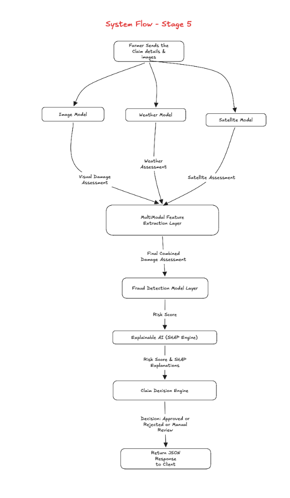

# Stage 5: Explainable AI (SHAP) & Interactive Web Dashboard

## Goal of Stage 5

Insurance regulations and ethical AI standards require that automated decisions are never "black boxes." When an automated system rejects a farmer's claim or flags it for investigation, insurance companies must legally and ethically be able to explain **why** that decision was reached in clear, plain language.

Stage 5 delivers two core components:

1. **Explainable AI (SHAP - SHapley Additive exPlanations):**
   - Implements `shap.TreeExplainer` on top of our trained XGBoost classifier (Mentor Requirements: Section 6 & Contribution 3).
   - Breaks down the final Fraud Risk Score into individual positive and negative feature contributions.
   - Translates mathematical Shapley values into human-readable plain-English explanation cards for farmers and insurance adjusters.

2. **Interactive Web Dashboard:**
   - A modern, responsive web application for both farmers and insurance adjusters.
   - Features an interactive **Leaflet.js map** for drawing farm field boundary polygons and auto-calculating GPS coordinates and land acreage.
   - Supports multi-image photo upload with live preview and client-side base64 conversion.
   - Renders visual multi-tier assessment cards (Leaf Vision, Weather Anomaly, Satellite Remote Sensing, XGBoost Decision, and SHAP Explainability Waterfall).



---

## 1. Explainable AI: What is SHAP and Why Use It?

### 1.1 The Black-Box Problem
In Stage 4, the XGBoost classifier predicts a continuous fraud risk score:
$$\text{Fraud Risk Score} = 0.95 \implies \text{REJECTED}$$

If an insurance company simply tells a farmer *"Your claim is rejected because the AI gave a 95% fraud score"*, the farmer has no idea why, and regulators will consider the AI untrustworthy and arbitrary.

### 1.2 The Solution: Shapley Values
SHAP (originating from cooperative game theory) computes the exact contribution of each evidence feature to the final prediction:

$$\text{Final Prediction} = \text{Base Value} + \sum_{i=1}^{M} \phi_i$$

Where:
* $\text{Base Value}$ is the average risk score across all historical claims.
* $\phi_i$ is the Shapley value (positive or negative contribution) of feature $i$.

### 1.3 Translating SHAP to Plain English
For every claim evaluated, the Explainable AI Engine will produce structured factor cards:

| Feature | Observed Value | SHAP Impact | Plain-English Explanation |
| :--- | :--- | :--- | :--- |
| `satellite_vs_claim_gap` | $+65.1\%$ | $+38.5\%$ | Claimed 65.1% loss, but satellite verified 0.0% damaged land. |
| `weather_score` | $0.9\%$ | $+24.2\%$ | Weather records showed calm conditions (1.9mm rain), contradicting claimed disaster. |
| `claims_frequency_12m`| 16 claims | $+14.0\%$ | High claim filing frequency (16 claims in past 12 months). |
| `visual_damage_severity`| $2.0\%$ | $+18.3\%$ | Uploaded crop leaf photos showed healthy unblemished crops. |

---

## 2. Interactive Web Dashboard Architecture

The dashboard will be built using Vanilla HTML5, CSS3, and JavaScript, ensuring fast performance, no build-step complexity, and zero external dependency bloat.

### 2.1 Dashboard Layout and Tabs

```text
┌────────────────────────────────────────────────────────────────────────┐
│  CropShield AI - Agricultural Crop Insurance & Fraud Detection         │
├───────────────────┬────────────────────────────────────────────────────┤
│ Navigation Tabs:  │ [1. Submit Claim]  [2. Evaluation Report]  [3. Registry] │
└───────────────────┴────────────────────────────────────────────────────┘
```

#### Tab 1: Submit Claim (Farmer Intake Form)
1. **Farmer & Crop Identity:** Farmer ID, Crop Type (Rice, Wheat, Corn), Claim Date.
2. **Interactive Farm Field Map (Leaflet.js):**
   - Farmer pans/zooms to their field.
   - Farmer clicks to draw their field boundary polygon using polygon drawing tools.
   - Automatically calculates total field area in hectares and field centroid (latitude/longitude).
3. **Damage Claim Inputs:**
   - Incorporates Proposal 1 from `docs/to_be_resolved_1.md`:
     - *Estimated Affected Field Area %* (macro land area).
     - *Crop Destruction Severity in Damaged Zone %* (micro plant condition).
4. **Crop Photo Upload:**
   - Drag-and-drop or camera file upload supporting single or multiple photos.
   - Live image thumbnails with delete button and instant preview.
5. **Submission Action:**
   - One-click "Submit Claim for AI Assessment" with stage-by-stage live progress bar:
     $$\text{Vision} \to \text{Weather} \to \text{Satellite} \to \text{XGBoost Fraud} \to \text{SHAP XAI} \to \text{Decision}$$

#### Tab 2: Live Claim Evaluation Report
Displays the completed 5-stage assessment cards:
1. **Executive Decision Banner:**
   - Large badge: `APPROVED` (Green), `MANUAL_REVIEW` (Amber), or `REJECTED` (Red).
   - Risk score meter (e.g. `95.0% Fraud Risk`).
   - Recommended Payout amount (e.g. `75.0% payout`).
2. **Tier 1 (Leaf Vision Card):** Visual class, severity %, confidence %, thumbnail gallery.
3. **Tier 2 (Weather Verification Card):** Historical rainfall mm, max temp, consecutive dry days, hazard match.
4. **Tier 3 (Satellite Remote Sensing Card):** Pre/Post NDVI difference ($\Delta \text{NDVI}$), damaged land %, field hectares.
5. **Tier 4 (Fraud Anomaly Flags Card):** Specific triggered flags (`DAMAGE_EXAGGERATION_SUSPECTED`, `WEATHER_CONTRADICTION`, `DUPLICATE_IMAGE_DETECTED`).
6. **Tier 5 (Explainable AI / SHAP Card):**
   - Interactive bar chart showing how each piece of evidence shifted the risk score.
   - Plain-English bullet list explaining the reason for approval or rejection.

#### Tab 3: Claims Registry & Adjuster Portal
- Data table listing all submitted claims stored in the SQLite database.
- Search and filter by Farmer ID, Crop Type, and Status (`APPROVED`, `MANUAL_REVIEW`, `REJECTED`).
- Clicking any row instantly loads its complete multimodal evidence and SHAP explanation report.

---

## 3. Implementation Tasks

### Task 5.1: Core Explainable AI Engine (`server/app/core/xai_engine.py`)
- Initialize `shap.TreeExplainer` on the trained XGBoost model artifact (`xgboost_fraud.pkl`).
- Build `explain_claim(feature_vector)`:
  - Computes exact Shapley values.
  - Sorts features by impact.
  - Converts mathematical Shapley values into human-readable explanation sentences.
- Expose via `POST /api/fraud/explain` and include in `POST /api/claims` response under `explainableAi`.

### Task 5.2: Static File Serving & Frontend Setup
- Create web assets in `client/`:
  - `client/index.html`
  - `client/styles.css`
  - `client/app.js`
- Mount `client/` in `server/app/main.py` so the web dashboard is served directly at `http://localhost:8000/`.

### Task 5.3: Interactive Leaflet Map & Boundary Tools
- Integrate Leaflet.js with OpenStreetMap satellite/street tiles.
- Allow farmers to search coordinates, click to draw boundary polygons, and view acreage in hectares.

### Task 5.4: Multi-Photo Intake & Live Progression UI
- Build client-side image compression, preview, and base64 encoding.
- Build progress tracker showing real-time multi-stage evaluation.

### Task 5.5: SHAP Visual Cards & Claims Registry
- Render horizontal bar charts representing positive and negative SHAP contributions.
- Connect Claims Registry to `GET /api/claims` and `GET /api/claims/{claim_id}`.

### Task 5.6: Verification & Browser Subagent Testing
- Test SHAP API with automated test script.
- Verify web dashboard interactive UI in the browser.
